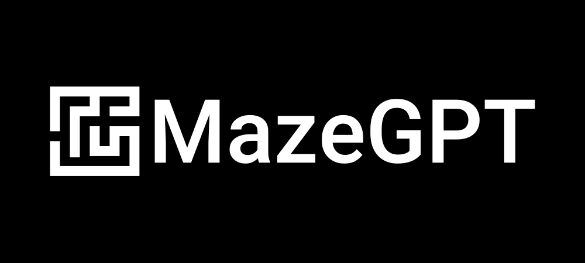

#### Disclaimers
Does some maze generation and stuff. Working on this because I'm bored.
All this thing knows is mazes. By no means am I a master of machine learning. 
Hugging face and OpenAI are the ones to thank here.

|                                    |                                |
|:----------------------------------:|:------------------------------:|
|  |  |
|                                    |                                |

# 🔍 Table of Contents
* 🌎 [Introduction](#introduction)
* ⏩ [Quickstart](#-quickstart)
* 📗 [Overview](docs/OVERVIEW.md#-overview)
  * ⚠️ [Problem](docs/OVERVIEW.md#-the-problem)
  * 📐 [Representation](docs/OVERVIEW.md#-representing-a-maze)
  * 📤 [Tokenizer](docs/OVERVIEW.md#-tokenizer)
* 🔧 [Getting Started](docs/GETTING_STARTED.md)

## Introduction
["Attention Is All You Need"](https://proceedings.neurips.cc/paper_files/paper/2017/file/3f5ee243547dee91fbd053c1c4a845aa-Paper.pdf) 
was a ground break paper in the world of machine learning in 2017.
The idea of a transformer has dramatically helped reduced the train time while improving the consistency
of attention across long periods of recurrent generation. The company [OpenAI](https://openai.com/) has two models ChatGPT and DALL·E both implementing transformers to achieve 
incredible results. 

The objective of this research project was to implement a transformer model for generating mazes. 
While there are numerous existing maze algorithms that perform well, they tend to produce recurrent patterns despite 
being seeded randomly. The goal is to achieve mazes that are more random and chaotic in nature and mimic human behavior.

For more detailed information visit the [Overview](docs/OVERVIEW.md)

## 🔧 Quickstart
TODO

## Authors
- Noah Hein ([@noah-hein](https://github.com/noah-hein))

