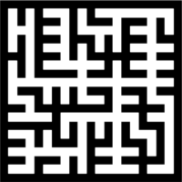
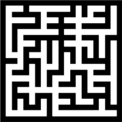

[](https://www.python.org/downloads/release/python-3110/)
[](https://GitHub.com/noah-hein/mazeGPT/releases/)

[](https://github.com/pylint-dev/pylint)
[](https://github.com/noah-hein/mazeGPT/blob/main/LICENSE)
[](https://github.com/noah-hein/mazeGPT/commits/master)
[](https://GitHub.com/noah-hein/mazeGPT/pull/)

#### Disclaimers
Does some maze generation and stuff. Working on this because I'm bored.
All this thing knows is mazes. By no means am I a master of machine learning. 
Hugging face and OpenAI are the ones to thank. They are doing the heaving lifting here.

Lots of inspiration from [NanoGPT](https://github.com/karpathy/nanoGPT) 
and [Andrej Apathy's](https://github.com/karpathy) 
great [video](https://www.youtube.com/watch?v=kCc8FmEb1nY).

|                                    |                                |
|:----------------------------------:|:------------------------------:|
|  |  |
|                                    |                                |

# 🔍 Table of Contents
* 🌅 [Introduction](#introduction)
* 🌌 [Overview](#overview)
* ⏩ [Quickstart](#-quickstart)
  * [Installation](#installation)
  * [CLI](#cli)
* 🏢 [Structure](docs/STRUCTURE.md#-structure)
* 🎓 [Authors](#-authors)

## 🌅 Introduction
["Attention Is All You Need"](https://proceedings.neurips.cc/paper_files/paper/2017/file/3f5ee243547dee91fbd053c1c4a845aa-Paper.pdf) 
was a ground break paper in the world of machine learning in 2017.
The idea of a transformer has dramatically helped reduced the train time while improving the consistency
of attention across long periods of recurrent generation. The company [OpenAI](https://openai.com/) has two models ChatGPT and DALL·E both implementing transformers to achieve 
incredible results. 

The objective of this research project was to implement a transformer model for generating mazes. 
While there are numerous existing maze algorithms that perform well, they tend to produce recurrent patterns despite 
being seeded randomly. The goal is to achieve mazes that are more random and chaotic in nature and mimic human behavior.

## 🌌 Overview
Recursive language models specifically transformers are very good at generating out semi-related strings.
The purpose of this experiment is to determine if this model could be applied to a more rigid two-dimensional
continuous structure.

### 🧩 Why
There are plenty of maze algorithms already out there that do a decent job at generating perfect maze.
The problem with these algorithms is that even with noise and different seeds, recognizable patterns form.

|                           Prims                            |                                 Binary Tree                                  |
|:----------------------------------------------------------:|:----------------------------------------------------------------------------:|
|  |  |
|  |  |
|  |  |

As you might begin to see, the used algorithms almost have a unique characteristic to them.
To the human eye these patterns become easily aparent at a distance. I've noticed this effect still holding
true no matter the size of the maze.

The idea would be to generate and train the network on thousands of mazes.
By doing this, hopefully the algorithm will learn how to make different segments and their relative relationships.
The end goal is to make a more human like design pattern, one without a fingerprint.

### 📐 Representing a Maze
The easiest approach to representing a maze is with graph theory!
Each node in the graph can be thought of as a junction within the maze.


The focus of this project will be around perfect mazes. A perfect maze is the same as a spanning tree.
In fact several already existing algorithms use this principal for generation.

Perfect Maze Definition:
- No cycles
- No unfilled spaces (within the bounds)
- No matter where you start / end, there should only be one path


For storage purposes we will represent the structure as a two-dimensional matrix.
Each node in the maze (excluding the metadata nodes) can be represented as a 0 or 1.

### 📤 Tokenizer
So you might be asking "How the hell do you represent a graph with characters?"

For the sake of simplicity I've decided to go with an approach similar to binary (for now)
The encoding is as follows.

Encoding:
- 0 = path
- 1 = wall
- <|HxW|> = start tag
- <|end|> = end tag

Since this is a very simple recurrent neural network, 
it operates in a linear fashion (Instead of in a higher dimension).
The maze can now be interpreted as a string of tokens, nice!

#### Example
##### Image

##### Matrix
```text
[ 1 1 1 1 1 1 1 1 1 1 1 ]
[ 1 0 0 0 0 0 0 0 1 0 1 ]
[ 1 0 1 0 1 1 1 0 1 0 1 ]
[ 1 0 1 0 0 0 1 0 1 0 1 ]
[ 1 0 1 1 1 0 1 0 1 0 1 ]
[ 1 0 1 0 1 0 1 0 1 0 1 ]
[ 1 0 1 0 1 0 1 1 1 0 1 ]
[ 1 0 1 0 1 0 0 0 1 0 1 ]
[ 1 0 1 0 1 0 1 0 1 0 1 ]
[ 1 0 0 0 1 0 1 0 0 0 1 ]
[ 1 1 1 1 1 1 1 1 1 1 1 ]
```
##### Encoding
<|5x5|>1111111111110000000101101011101011010001010110111010101101010101011010101110110101000101101010101011000101000111111111111<|end|>

## ⏩ Quickstart
### Installation
Below are the steps you should follow in order to set up the project environment.
If you are familiar with venv and PyTorch the installation section can be skipped.

#### Virtual Environment (Optional)
For this project, it's advisable to create a Python virtual environment to manage the project's dependencies. 
While this is not mandatory, it significantly simplifies the process of initializing the project.

To create a virtual environment named 'venv', execute the command shown below.
```bash
python -m venv venv       # Creates virtual env
$ .\venv\Scripts\activate   # Activate venv
```

#### GPU Support (Optional)
This project primarily utilizes Huggingface Transformers for the configuration of numerous model and training logic 
aspects. The underlying framework is PyTorch, although it could be substituted with Tensorflow if preferred. 
It's crucial to have PyTorch installed to operate the trainer.

Upon setup, the CPU variant of PyTorch is the default installation. However, if you have access to a GPU, its use is 
strongly recommended. Due to their intensive computational requirements, Transformer models perform slowly when executed 
on a CPU.

To install the GPU variant vist [PyTorch Getting Started](https://pytorch.org/get-started/locally/)

```bash
# Example command for installing PyTorch CUDA 11.8 Windows
$ pip3 install torch torchvision torchaudio --index-url https://download.pytorch.org/whl/cu118
```

#### Installing Dependencies
To install all the required dependencies run the following.
```bash
$ pip install -r requirements.txt
```

### CLI
This project was built around the [Hydra](https://hydra.cc) framework to simplify configuration.
The library makes it really easy to run different scripts in the style of a command line interface.

The library allows the user to select create, select, and update configuration files. On top of that you can directly
modify individual directly in the command line arguments. For more information on how to use Hydra visit their 
[Getting Started](https://hydra.cc/docs/intro/)

The `mazegpt.py` is the entrypoint script for the entire application.
To start the application run the following.

```bash
# Application entrypoint
$ python .\mazegpt.py
```

```bash
# Displays all the available configuration options
$ python .\mazegpt.py --help
```

If you want to select a specific configuration file in the `conf` folder run the following.
```bash
# Use different configuration file
$ python .\mazegpt.py --config-name=gpu
```

#### Actions
The action configuration option is how you select the ML script to run.
All available actions are stored in a dictionary. Feel free to add more!

```python
actions = {
    "prepare": MazeAIPrepare,
    "train": MazeAITrainer,
    "sample": MazeAISampler
}
```

To run a command simply modify the `action` configuration option in the file or via the CLI arguments.
`NOTE: CLI arguments will write over your configuration files options`

Below are all the available actions.

##### Prepare
The prepare action creates a bunch of mazes and stores it in the output folder.
These mazes are built based on the settings from the provided `configuration`.
```bash
$ python .\mazegpt.py 'action=prepare'
```

##### Train
Starts the training of the ML algorithm. Outputs the models to the designated folder
```bash
$ python .\mazegpt.py 'action=train'
```

##### Sample
Visually shows the model being used to generate a new maze
```bash
# Reference the model in use
$ python .\mazegpt.py 'action=sample' 'model=out/models/checkpoint-67500'

```

## 🎓 Authors
- Noah Hein ([@noah-hein](https://github.com/noah-hein))


